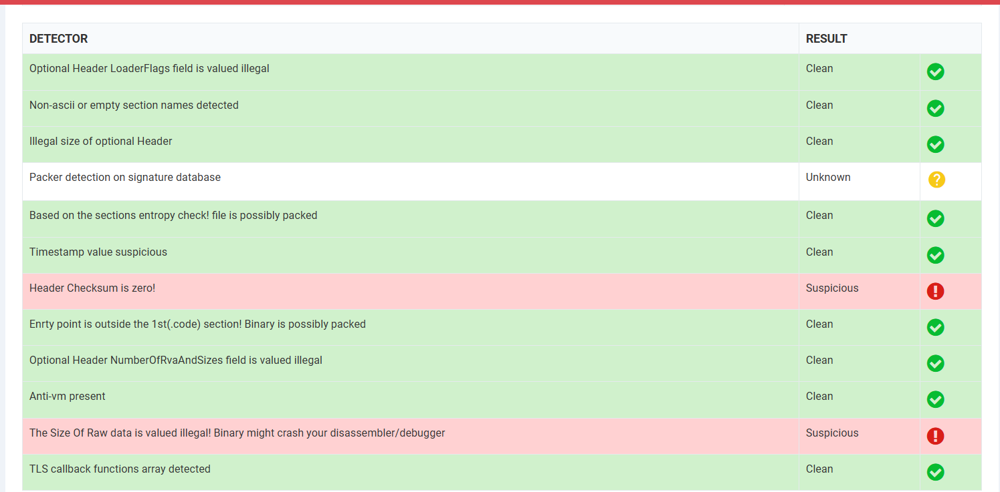
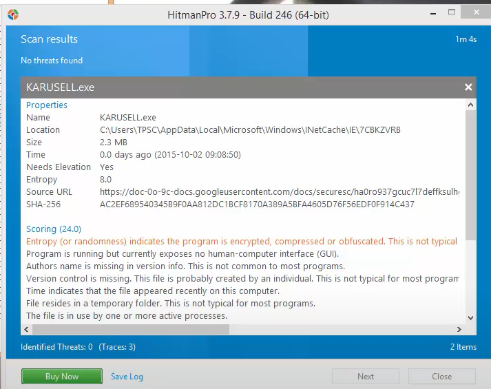

# HydraDragonAntivirusHeuristics-
- Hydra Dragon Antivirus new heurisitics
- Inspired by Hitman Pro suspicious file detection anD Comodo/Xcitium Valkyrie static analysis
- Status: abadoneded due to all features already exists in machine learning or feature causing too many false positives (Comodo static analysis) or only good for signature creation not scanning (xml file)

